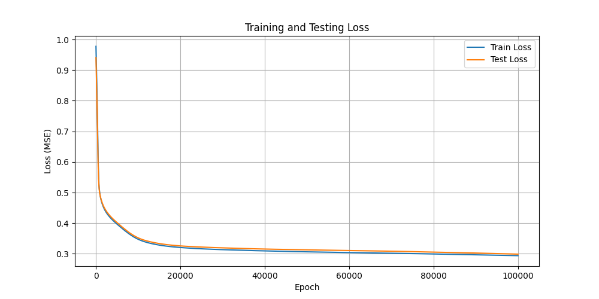
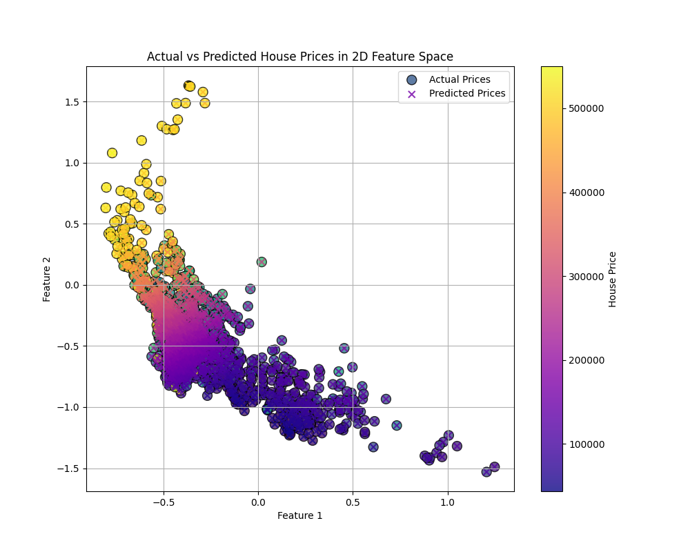
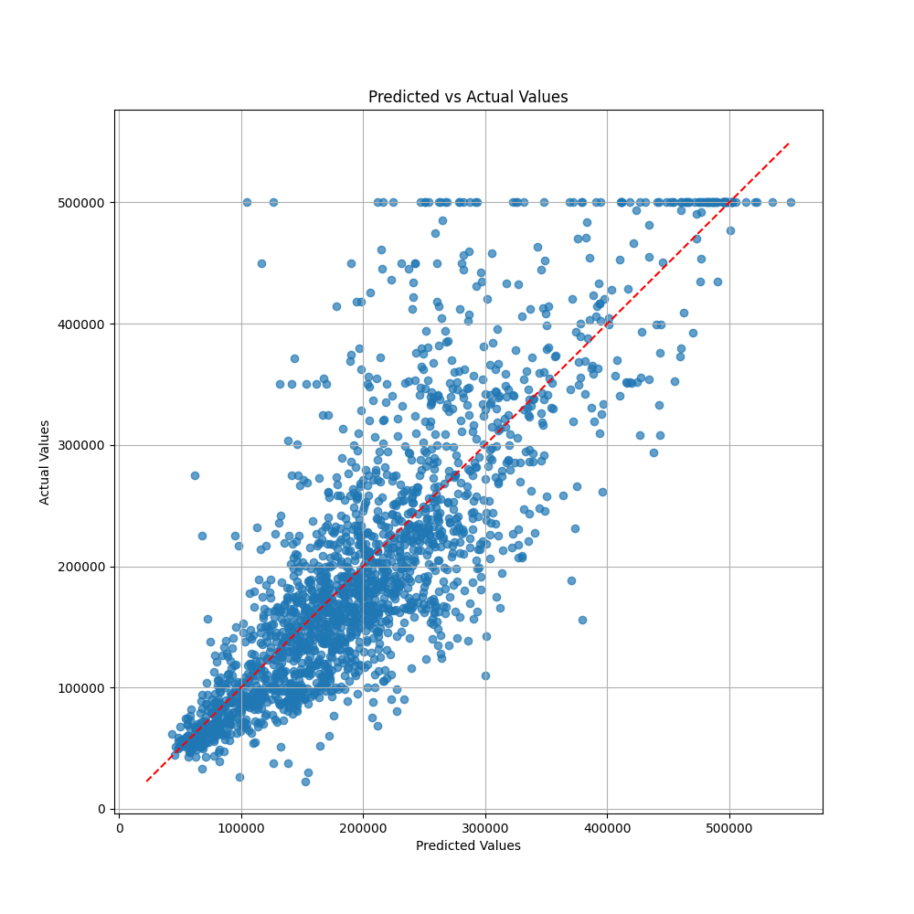

# 实验四：基于多层感知机（MLP）的房价预测

## 1. 实验目的
- 理解多层感知机（MLP）的基本原理和结构。
- 掌握使用 PyTorch 从零开始构建、训练和评估 MLP 模型的方法。
- 学会数据预处理、模型参数初始化、前向传播、反向传播和参数更新等关键步骤。
- 能够可视化训练过程（如损失曲线）和模型性能（如预测值与真实值对比）。
- 探索特征降维和可视化在模型理解中的应用。

## 2. 实验环境
- 操作系统：Windows (或其他，根据实际情况填写)
- 开发工具：Visual Studio Code
- 编程语言：Python
- 主要库：PyTorch, NumPy, Pandas, Matplotlib, Scikit-learn
- 数据集：`MLP_data.csv` (包含房价相关特征及房价)

## 3. 实验原理
本实验构建一个多层感知机（MLP）来预测房价。MLP 是一种前馈神经网络，包含输入层、一个或多个隐藏层以及一个输出层。
- **数据预处理**：对输入特征和目标变量进行标准化处理，以改善模型的训练稳定性和收敛速度。
- **模型结构**：
    - 输入层：接收房产特征。
    - 编码器：包含一个隐藏层，将输入特征映射到一个激活的表示，然后通过另一个线性层降维到2D特征空间。
    - 解码器：包含一个隐藏层，将2D特征映射回一个激活的表示，然后通过输出层预测房价。
    - 激活函数：ReLU 激活函数用于隐藏层，增加模型的非线性表达能力。
    - Dropout：可选的 Dropout 层用于防止过拟合。
- **参数初始化**：权重采用 Xavier/Glorot 初始化，偏置初始化为零。
- **损失函数**：使用均方误差（MSE）作为损失函数，衡量模型预测值与真实值之间的差异。
- **优化器**：通过手动实现梯度下降算法更新模型参数（权重和偏置），并加入 L2 正则化（权重衰减）以防止过拟合。
- **前向传播**：输入数据通过网络层层传递，计算得到预测输出和中间的2D特征。
- **反向传播**：根据损失函数计算梯度，并将梯度从输出层反向传播到网络的每一层，用于更新参数。
- **模型评估**：使用均方根误差（RMSE）评估模型在测试集上的性能。同时，可视化损失曲线、2D特征空间中的预测以及预测值与真实值的对比图。

## 4. 实验步骤

### 4.1 数据加载与预处理
1.  使用 Pandas 加载 `MLP_data.csv` 数据集。
2.  分离特征（X）和目标变量（y）。
3.  将数据集划分为训练集和测试集。
4.  使用 `StandardScaler` 对特征和目标变量分别进行标准化处理。
5.  将处理后的数据转换为 PyTorch 张量。

### 4.2 MLP 模型定义
1.  实现 `MLP` 类，包含权重和偏置的初始化。
2.  实现 `relu` 激活函数和 `dropout` 层。
3.  实现 `forward` 方法：
    -   编码器部分：`input -> hidden1 (ReLU, Dropout) -> 2D features`
    -   解码器部分：`2D features -> hidden2 (ReLU, Dropout) -> output`
4.  实现 `backward` 方法：根据 MSE 损失计算各层参数的梯度。
5.  实现 `update_parameters` 方法：根据计算得到的梯度和学习率更新模型参数，并加入权重衰减。
6.  实现 `state_dict` 和 `load_state_dict` 方法用于模型的保存和加载。

### 4.3 模型训练
1.  实例化 MLP 模型。
2.  尝试加载预训练模型（如果存在）。
3.  设置超参数：学习率、训练轮次、隐藏层大小等。
4.  进行指定轮次的训练：
    a.  模型前向传播，得到预测输出。
    b.  计算训练损失（MSE）。
    c.  模型反向传播，计算梯度。
    d.  更新模型参数。
    e.  在测试集上评估模型，计算测试损失，并记录。
    f.  保存测试损失最低时的模型参数。
    g.  定期打印训练和测试损失。

### 4.4 模型评估与可视化
1.  加载表现最佳的模型。
2.  在测试集上进行最终评估，计算原始尺度上的 RMSE。
3.  绘制训练和测试损失随训练轮次变化的曲线图，并保存为 `loss_curves.png`。
4.  将测试数据通过模型编码器部分降维到2D特征，并绘制散点图，用颜色表示实际房价和预测房价，保存为 `price_comparison_2d.png`。
5.  绘制测试集上预测房价与实际房价的对比散点图，并添加一条 y=x 的参考线，保存为 `predicted_vs_actual.png`。
6.  保存最终训练好的模型参数到 `mlp_model.pth`。

## 5. 实验结果与分析

### 5.1 训练与测试损失曲线

*图 1：训练与测试损失曲线图*

**分析**：
图 1 展示了模型在训练过程中训练损失和测试损失随迭代次数的变化情况。
-   初始阶段，训练损失和测试损失均迅速下降，表明模型在快速学习数据中的模式。
-   随着训练的进行，损失下降速度减缓，并逐渐趋于稳定。
-   训练损失持续略低于测试损失，这是正常现象。两条曲线最终收敛到一个较低的水平，且没有出现测试损失显著反弹上升的情况，表明模型没有发生严重的过拟合。模型在训练集和测试集上都表现出较好的泛化能力。

### 5.2 二维特征空间中的房价预测

*图 2：二维特征空间中实际房价与预测房价对比图*

**分析**：
图 2 展示了通过模型编码器部分将测试集样本降维到二维特征空间后的分布情况。图中点的颜色深浅代表房价高低，圆点代表实际价格，叉号代表模型预测的价格。
-   可以看出，模型学习到的二维特征在一定程度上能够区分不同价位的房产。相似价格的房产在二维空间中倾向于聚集在一起。
-   通过对比相同位置圆点和叉号的颜色，可以直观地感受到模型对房价的预测效果。在大部分区域，预测价格（叉号颜色）与实际价格（圆点颜色）的趋势较为一致。

### 5.3 预测值与真实值对比

*图 3：预测值与真实值对比散点图*

**分析**：
图 3 展示了模型在测试集上的预测房价与实际房价的对比散点图。图中的红色虚线表示理想情况下的完美预测（预测值=真实值）。
-   散点大部分分布在红色虚线附近，表明模型的预测结果与真实值较为接近。
-   这说明模型学习到了数据中的主要趋势，并能够对未见过的数据做出相对准确的预测。
-   最终计算得到的测试集 RMSE 为 [请在此处填写脚本输出的 Test RMSE 值，例如：Test RMSE: 70000.0000]，该值也量化了模型的预测精度。

## 6. 实验结论
通过本次实验，成功构建并训练了一个多层感知机模型用于房价预测。
-   模型能够有效地从数据中学习特征，并在测试集上取得了较好的预测效果，具体表现为较低的测试损失和RMSE。
-   损失曲线表明模型训练稳定且未出现明显过拟合。
-   二维特征可视化和预测值与真实值对比图进一步验证了模型的有效性。
-   手动实现 MLP 的各个组件加深了对神经网络工作原理的理解。

## 7. 实验心得
在本次实验中，我学习了如何从零开始构建一个包含编码器和解码器结构的 MLP 模型。关键的体会包括：
-   **数据预处理的重要性**：标准化处理对于神经网络的稳定训练至关重要。
-   **参数初始化的影响**：合理的参数初始化（如Xavier初始化）有助于避免梯度消失或爆炸，加速模型收敛。
-   **手动实现反向传播的挑战与收获**：虽然 PyTorch 等框架可以自动求导，但手动实现反向传播过程能更深刻地理解梯度是如何在网络中流动的，以及参数是如何被更新的。这个过程需要非常仔细地进行链式法则的推导。
-   **正则化的作用**：L2 正则化（权重衰减）有助于防止模型过拟合，提高泛化能力。
-   **可视化分析的价值**：通过绘制损失曲线、特征分布图和预测对比图，可以直观地监控训练过程、诊断模型问题并评估模型性能。
-   **模型保存与加载**：能够保存训练过程中的最佳模型并在后续使用，是实际应用中的一个重要环节。

遇到的问题及解决方法：
-   初期可能遇到梯度计算错误导致模型不收敛或损失爆炸，需要仔细检查反向传播的数学推导和代码实现。
-   超参数的选择（如学习率、隐藏单元数、正则化系数）对模型性能影响较大，通常需要通过实验进行调整。本实验中采用的参数是经过一定尝试后得到的较优组合。

总的来说，这次实验是一次宝贵的实践经历，不仅巩固了神经网络的理论知识，也提升了动手实现和调试模型的能力。
